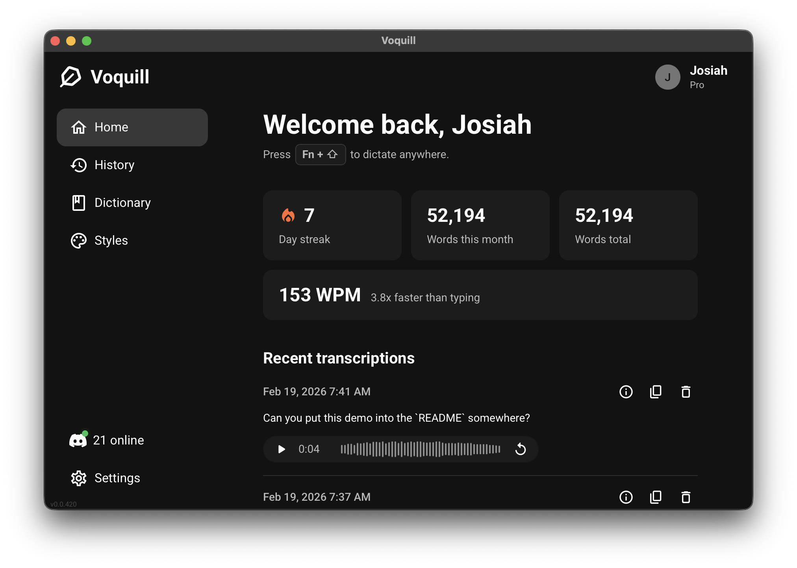
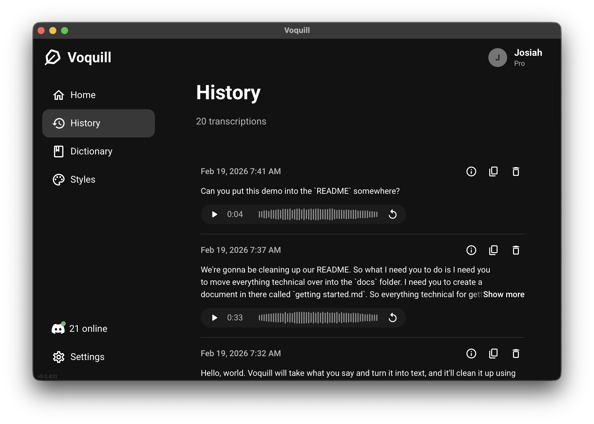
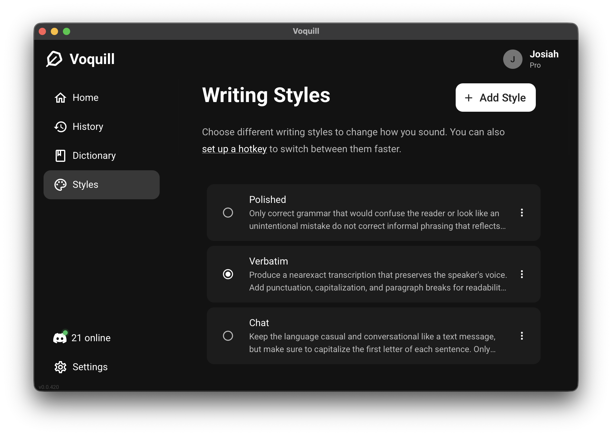
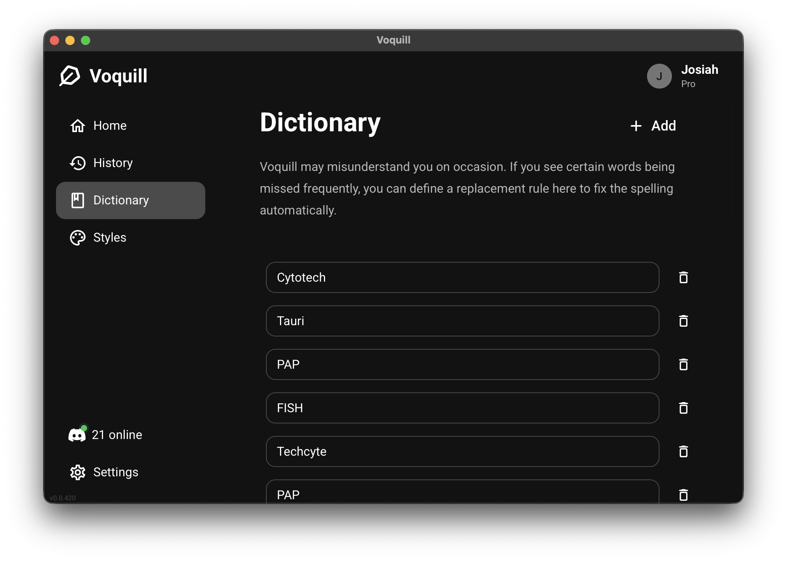
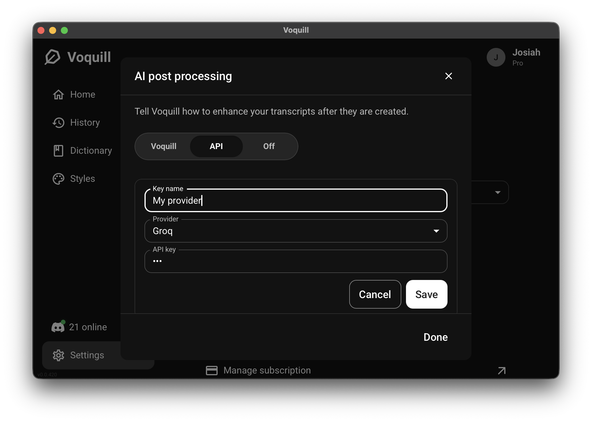

# Your keyboard is holding you back.

### Make voice your new keyboard. Type four times faster by using your voice.

 

**[Visit our website →](https://voquill.com)**

 

Voquill is an open-source, cross-platform AI voice typing app that lets you dictate into any desktop application, clean the transcript with AI, and keep your personal glossary in sync. The repo bundles the production desktop app, marketing site, Firebase backend, the mobile app, and all shared packages in a single Turborepo.

## Highlights

- Voice input everywhere: overlay, hotkeys, and system integrations work across macOS, Windows, and Linux.
- Choose your engine: run Whisper locally (with optional GPU acceleration) or point to a cloud provider of your choice.
- AI text cleanup: remove filler words and false starts automatically.
- Personal dictionary: create glossary terms and replacement rules so recurring names and phrases stay accurate.
- Batteries included: Tauri auto-updates, Firebase functions for billing and demos, and shared utilities/types.
- Privacy first: You have full control over your data. Run Voquill against any backend you wish, even offline.

## Screenshots

|                                                                                                                           |                                            |
| ------------------------------------------------------------------------------------------------------------------------- | ------------------------------------------ |
| **Home** — Track your streaks, words per minute, and recent transcriptions at a glance.                                   |                 |
| **History** — Browse and replay past transcriptions with full audio playback.                                             |                |
| **Writing Styles** — Switch between tones like Polished, Verbatim, and Chat to control how your voice sounds on the page. |  |
| **Dictionary** — Add custom terms and replacement rules so Voquill always spells your words correctly.                    |          |
| **Providers** — Bring your own API key and choose your preferred transcription and post-processing provider.              |            |

## License

Unless otherwise noted, Voquill is released under the AGPLv3. See `LICENCE` for the complete terms and third-party attributions.

## Contributing

See [docs/getting-started.md](docs/getting-started.md) for setup instructions and architecture details.
