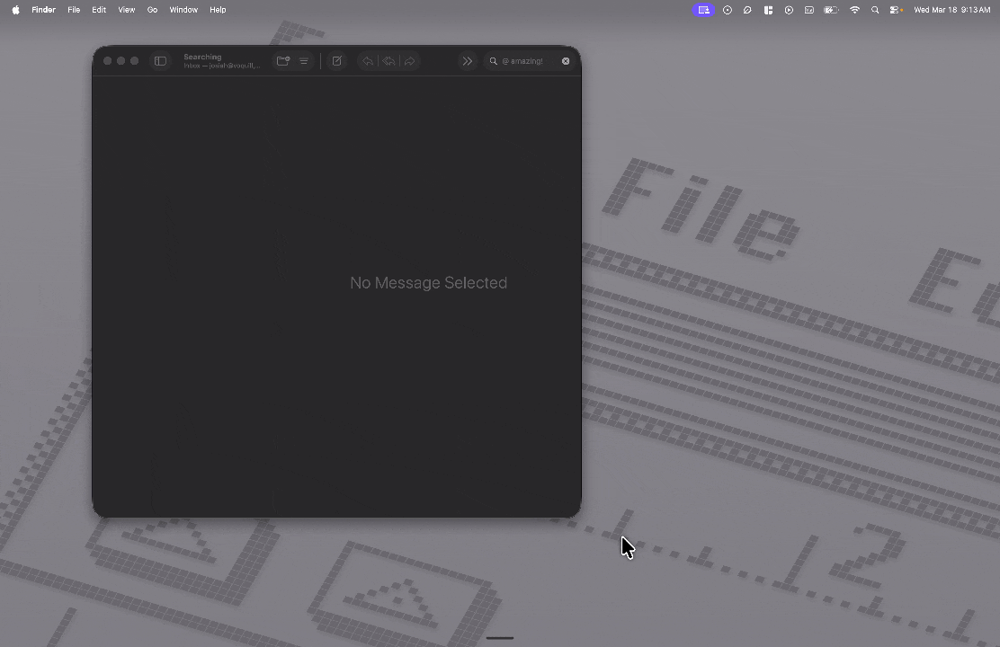
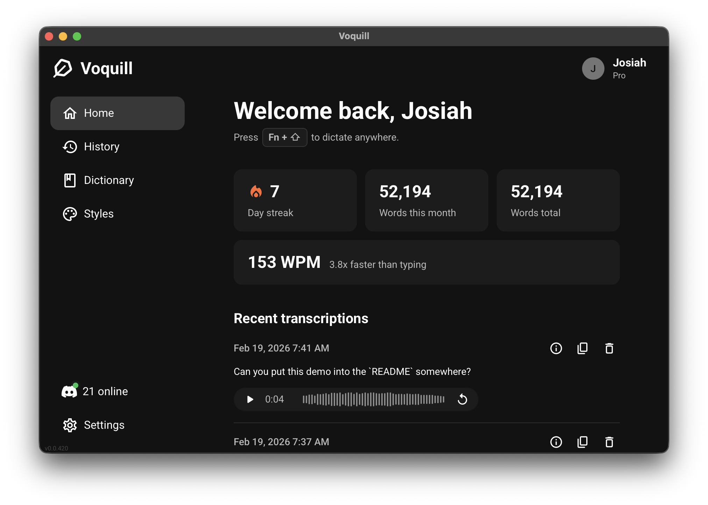
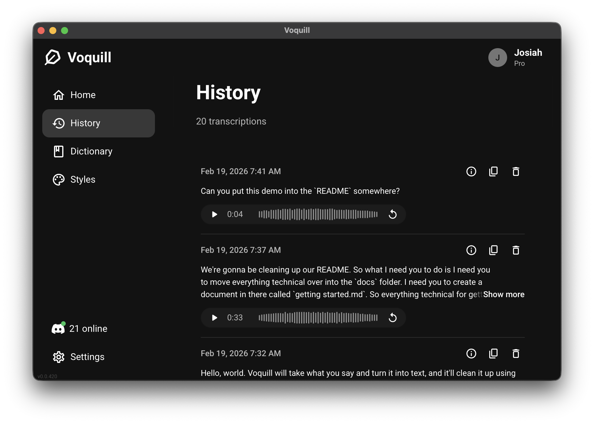
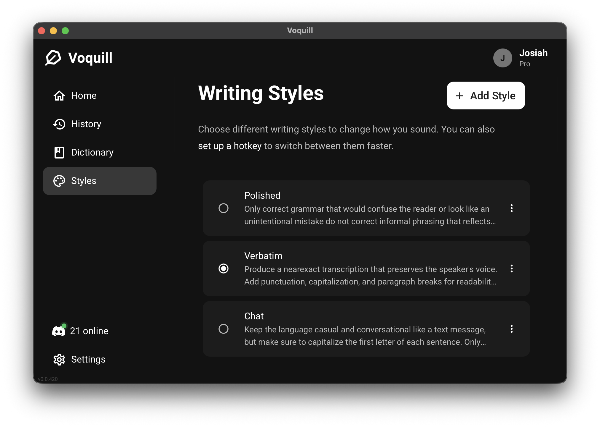
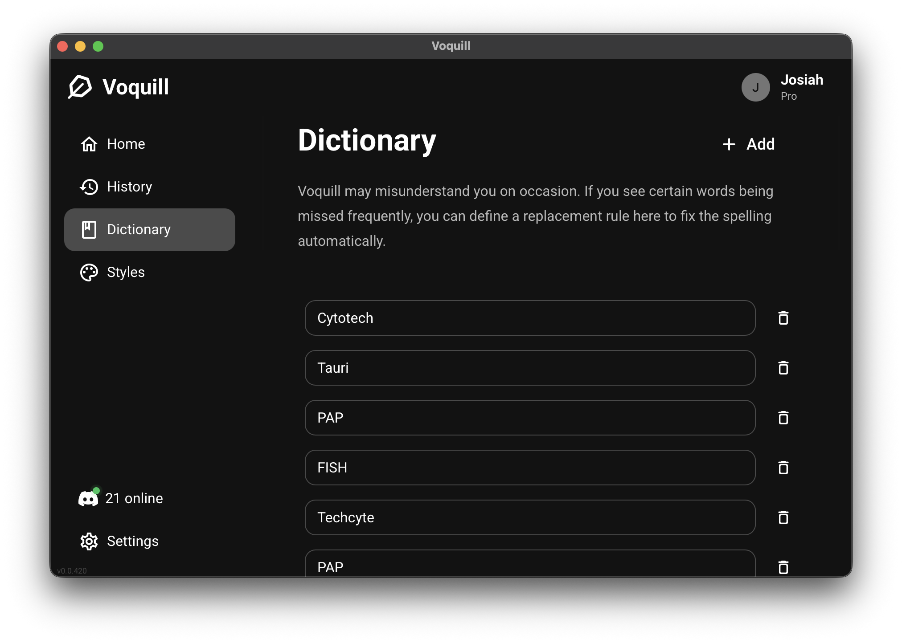
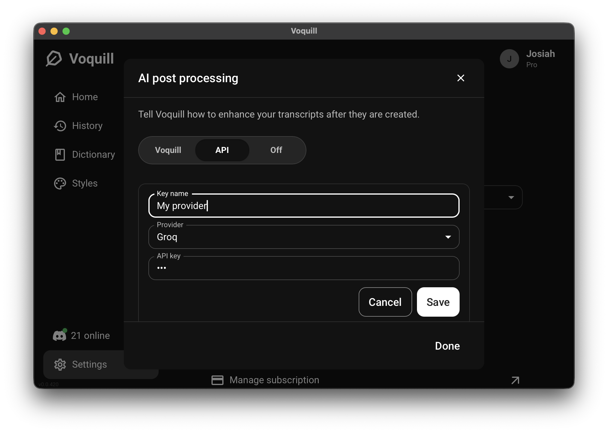
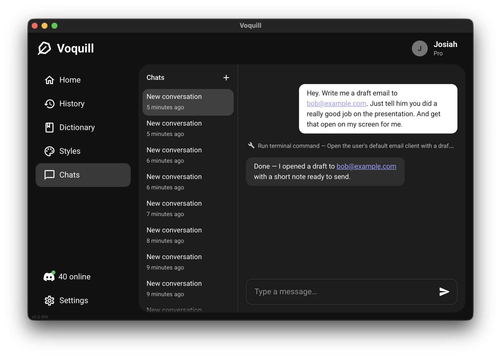

# Your keyboard is holding you back.

### Make voice your new keyboard. Type four times faster by using your voice.

 

**[Visit our website →](https://voquill.com)**

 
 

**Dictation**

 
 

**Assistant**

 

Voquill is an open-source, cross-platform AI voice typing app that lets you dictate into any desktop application, clean the transcript with AI, and keep your personal glossary in sync. The repo bundles the production desktop app, marketing site, Firebase backend, the mobile app, and all shared packages in a single Turborepo.

## Highlights

- Voice input everywhere: overlay, hotkeys, and system integrations work across macOS, Windows, and Linux.
- Choose your engine: run Whisper locally (with optional GPU acceleration) or point to a cloud provider of your choice.
- AI text cleanup: remove filler words and false starts automatically.
- Context-aware dictation: prompts can incorporate the active app/editor, selected text, and nearby on-screen accessibility context to improve final wording.
- Personal dictionary: create glossary terms and replacement rules so recurring names and phrases stay accurate.
- Batteries included: Tauri auto-updates, Firebase functions for billing and demos, and shared utilities/types.
- Privacy first: You have full control over your data. Run Voquill against any backend you wish, even offline.

## Dictation accuracy pipeline

The current desktop and mobile work shares a common dictation contract and context assembly flow. Highlights:

- Shared `@voquill/dictation-core` logic normalizes dictation context, glossary terms, and replacement rules across platforms.
- Desktop finalization persists raw, authoritative, and sanitized transcript fields so downstream cleanup works from a stable transcript contract.
- Provider-aware STT hints can incorporate active-app, editor, selected-text, and screen-context signals when a provider supports prompt guidance.
- Post-processing now receives richer dictation context, which improves entity spelling, formatting, and intent preservation.
- Streaming and final transcript reconciliation are aligned so live insertion and finalized text stay consistent.
- macOS local testing includes a safer permission gate and a dedicated local-install path for `/Applications/Voquill (local).app`.

See [docs/dictation-accuracy.md](docs/dictation-accuracy.md) for the detailed feature breakdown, mobile reuse notes, and the follow-up screen-capture context track.

## Screenshots

|                                                                                                                           |                                            |
| ------------------------------------------------------------------------------------------------------------------------- | ------------------------------------------ |
| **Home** — Track your streaks, words per minute, and recent transcriptions at a glance.                                   |                 |
| **History** — Browse and replay past transcriptions with full audio playback.                                             |                |
| **Writing Styles** — Switch between tones like Polished, Verbatim, and Chat to control how your voice sounds on the page. |  |
| **Dictionary** — Add custom terms and replacement rules so Voquill always spells your words correctly.                    |          |
| **Providers** — Bring your own API key and choose your preferred transcription and post-processing provider.              |            |
| **Chats** — Have voice-powered conversations with an AI assistant directly inside Voquill.                                |               |

## License

Unless otherwise noted, Voquill is released under the AGPLv3. See `LICENCE` for the complete terms and third-party attributions.

## Contributing

See [docs/getting-started.md](docs/getting-started.md) for setup instructions and architecture details.

We love our community! Thank you to everyone who has contributed to Voquill!

