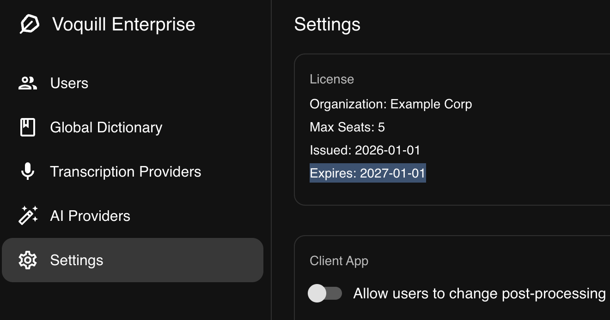

Your Managed Cloud deployment is active for the duration of your subscription. The Voquill team handles all server maintenance and updates during this period.

## Checking Your Subscription

You can visit the settings page on the admin portal to see when your subscription expires.

## Renewal

To renew, contact [enterprise@voquill.com](mailto:enterprise@voquill.com). Once renewed, your deployment continues without interruption — no action is needed on your end.

## Desktop Updates

The desktop app is updated automatically as part of the open-source Voquill client. Updates will be available upon release and can be managed within the app.
