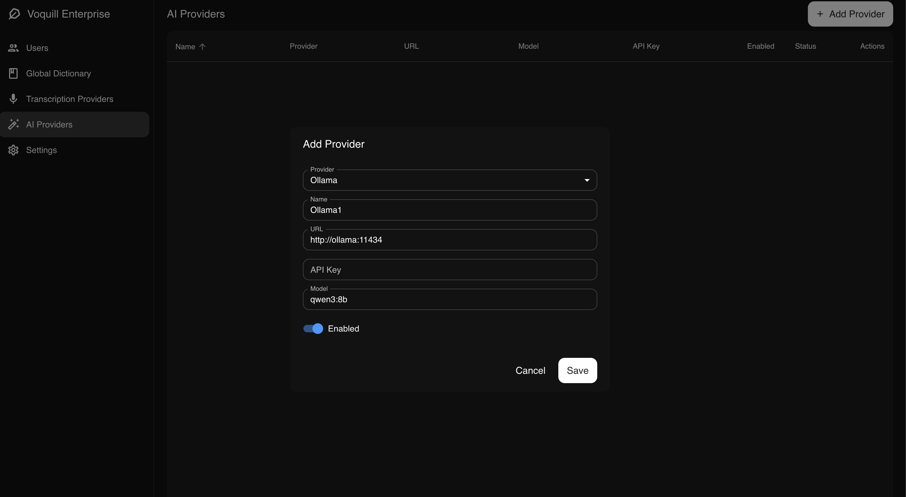
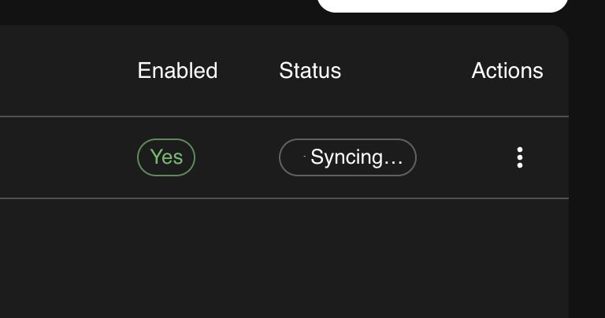

Local post-processing uses an LLM to clean up and format transcriptions without sending data to an external service. Voquill desktop clients are automatically pointed at providers you configure in the admin portal, so all post-processing traffic stays within your internal network.

## Overview

When you transcribe audio, the raw transcript can be improved by running it through an LLM. By hosting your own instance of [Ollama](https://ollama.com), you can keep this step entirely on-premise. This works best with a GPU. CPU-only distributions are available, but expect significantly slower inference times. We recommend at least 16 GB of RAM for most models.

## 1. Add Ollama to Docker Compose

Add the following service to the `docker-compose.yml` you created during [initial setup](/enterprise/on-premise/setup/):

```yaml
ollama:
  image: ollama/ollama:latest
  ports:
    - "11434:11434"
  volumes:
    - ollama_data:/root/.ollama
  networks:
    - voquill
```

And add the volume to your existing `volumes` section:

```yaml
volumes:
  postgres_data:
  ollama_data:
```

Start the service:

```bash
docker compose up -d ollama
```

## 2. Configure Voquill

Open the admin portal and navigate to the **AI Providers** page. Add a new provider with the following settings:

- **Type:** Ollama
- **URL:** `http://ollama:11434` (if running on the same Docker network) or `http://your-host:11434` (if running on a separate machine)
- **Model:** The model you want to use (e.g. `llama3`)



## 3. Pull a Model

After adding a provider, the UI shows the sync status of each model. You can monitor this to see whether the model has been pulled successfully, and click to retry if it failed. To change the model later, use the three-dot menu on the provider card to update the configuration. Voquill will automatically pull the new model.



You can also pull models manually from the command line:

```bash
docker compose exec ollama ollama pull llama3
```

You can use any model supported by Ollama. Choose one that fits your hardware and quality requirements.

## Scaling Across Machines

You can run multiple Ollama instances on different machines within your organization. Add each one as a separate provider in the admin portal. Voquill handles load balancing automatically and will distribute post-processing requests across all configured providers.
