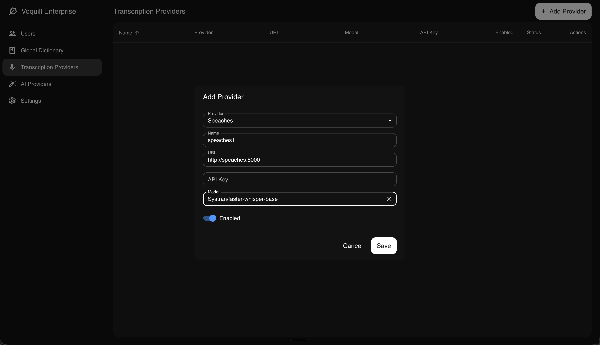
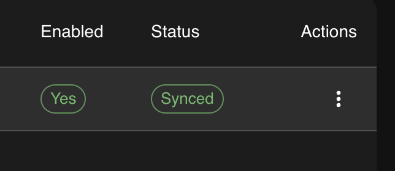

Local transcription converts speech to text on your own infrastructure without sending audio to an external service. Voquill desktop clients are automatically pointed at providers you configure in the admin portal, so all audio and transcription traffic stays within your internal network.

## Overview

By hosting your own instance of [Speaches](https://speaches.ai), you can run speech-to-text transcription entirely on-premise. Speaches is an OpenAI API-compatible server that uses faster-whisper for transcription. This works best with a GPU. CPU-only images are available, but expect significantly slower inference times. We recommend at least 16 GB of RAM for most models.

## 1. Add Speaches to Docker Compose

Add the following service to the `docker-compose.yml` you created during [initial setup](/enterprise/on-premise/setup/):

```yaml
speaches:
  image: ghcr.io/speaches-ai/speaches:latest-cpu
  ports:
    - "8000:8000"
  volumes:
    - speaches_data:/home/ubuntu/.cache
  networks:
    - voquill
```

And add the volume to your existing `volumes` section:

```yaml
volumes:
  postgres_data:
  speaches_data:
```

Start the service:

```bash
docker compose up -d speaches
```

## 2. Configure Voquill

Open the admin portal and navigate to the **Transcription Providers** page. Add a new provider with the following settings:

- **Type:** Speaches
- **URL:** `http://speaches:8000` (if running on the same Docker network) or `http://your-host:8000` (if running on a separate machine)
- **Model:** The model you want to use (e.g. `Systran/faster-whisper-base`)



## 3. Model Sync

After adding a provider, the UI shows the sync status of each model. You can monitor this to see whether the model has been pulled successfully, and click to retry if it failed. To change the model later, use the three-dot menu on the provider card to update the configuration. Voquill will automatically pull the new model.



## Scaling Across Machines

You can run multiple Speaches instances on different machines within your organization. Add each one as a separate provider in the admin portal. Voquill handles load balancing automatically and will distribute transcription requests across all configured providers.
